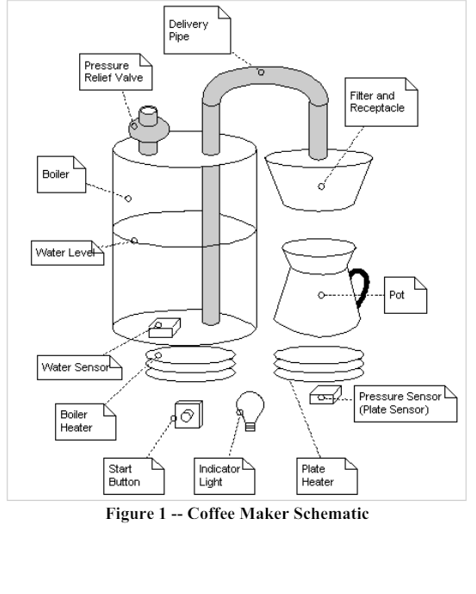
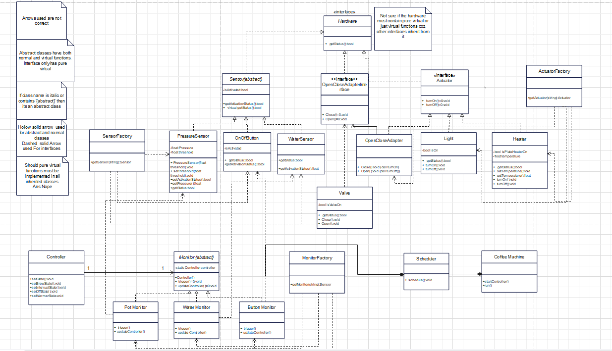
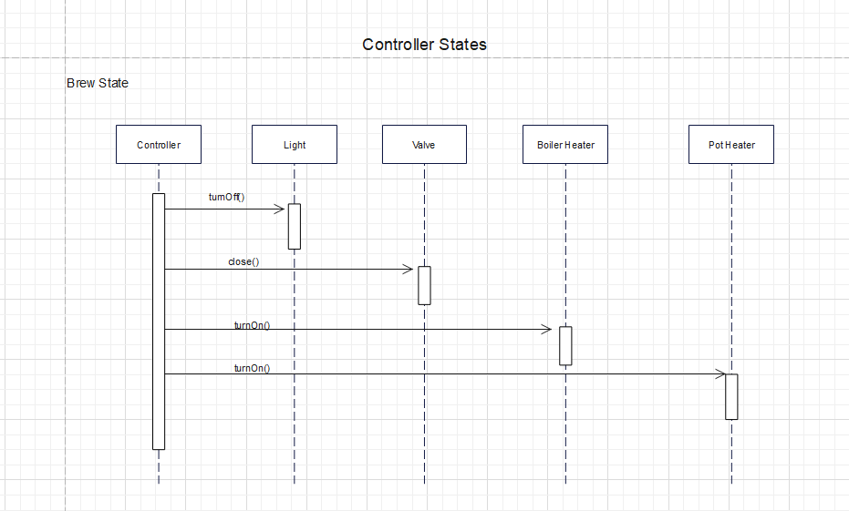
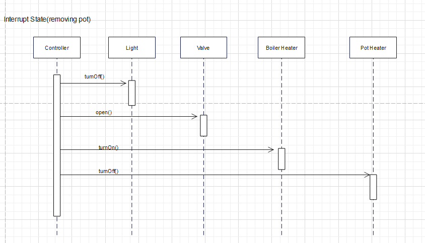
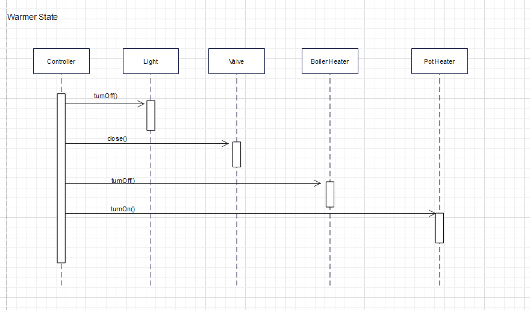

# CoffeeMachineSimulator
The project simulates the operation of a coffee machine in an interactive and user-friendly manner. It highlights the application of design patterns, SOLID principles, and object-oriented programming (OOP) concepts to ensure a well-structured, maintainable, and scalable solution. 
NOTE : Entire project is made using C++, Visual Studio 2017.

The project tries to simulate the behaviour of the below coffee Machine:

### Overview:
During the design of the system it was designed based on the categories like Sensors, Actuators and Controllers,  

### Use Case :
[Use Case of CoffeeMaker](Coffee_Machine/Design/Use_Case.txt)

### System Design:

### Sequence of Operation : 

State Diagrams represents multiple states that the Coffee Maker can take.

### STATE DIAGRAMS

### 1.Brew State:

### 2.Interrupt State:

### 3.Empty Boiler State:

### 4.Warmer State:

